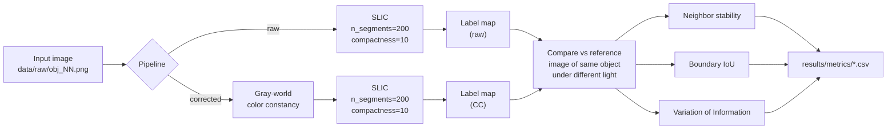

# Illumination-Invariant Superpixels

**Do superpixels stay put when the lighting changes — and does color constancy help?**

Superpixel algorithms like SLIC group pixels by color similarity, which makes them
fragile under changing illumination: move the light source and the segmentation
redraws itself, even though the underlying scene is identical. This project
quantifies that instability and tests whether a gray-world color constancy step,
applied before segmentation, makes superpixels more repeatable.

Short answer: **yes, consistently.** Across 4 objects × 11 illumination conditions,
color constancy improved every stability metric on every object.

<p align="center">
  <br>
  <em>Same apple, three lighting conditions. Left: input. Middle: SLIC on raw RGB.
  Right: SLIC after gray-world correction.</em>
</p>

---

## Key Result

Each image is segmented, then compared against the segmentation of a reference
image of the *same object* under *different* lighting. A stable method produces
similar segmentations regardless of the light.

| Metric | Raw RGB | + Gray-World CC | Change |
|---|---|---|---|
| Neighbor stability ↑ | 0.9711 | **0.9729** | +0.19% |
| Boundary IoU ↑ | 0.3331 | **0.3493** | **+4.84%** |
| Variation of Information ↓ | 1.2604 | **1.1747** | **−6.80%** |

Averaged over all 4 objects. ↑ = higher is better, ↓ = lower is better.
**Color constancy won on 4/4 objects for all 3 metrics** — the direction of the
effect is consistent, not an artifact of averaging.

The gain is largest where it should be. Boundary IoU and VI both measure whether
*the same boundaries* get drawn, and those improve meaningfully. Neighbor
stability barely moves because it is dominated by the large uniform background
regions that stay grouped either way.

---

## How It Works



**Gray-world color constancy** assumes the average reflectance of a scene is
achromatic. It computes the per-channel mean, then rescales each channel so all
three means match the global gray value — cancelling a global color cast from the
illuminant before SLIC ever sees the image.

**The comparison protocol** picks the first image of each object as the reference,
segments all 11 illumination variants, and scores every variant against that
reference. Raw is compared to the raw reference and CC to the CC reference, so
each pipeline is judged on its own self-consistency.

---

## Metrics

| Metric | What it measures | Range | Better |
|---|---|---|---|
| **Neighbor stability** | Fraction of adjacent pixel pairs grouped together in the reference that stay grouped in the variant | 0–1 | ↑ |
| **Boundary IoU** | Intersection-over-union of the two superpixel boundary maps | 0–1 | ↑ |
| **Variation of Information** | Information-theoretic distance between two partitions, `H(X) + H(Y) − 2·I(X;Y)` | 0–∞ bits | ↓ |
| **Boundary Recall** | Fraction of ground-truth edges recovered by superpixel boundaries | 0–1 | ↑ |
| **ASA** | Achievable Segmentation Accuracy — ceiling on accuracy given the superpixel partition | 0–1 | ↑ |

All five are implemented in `src/metrics.py`. The stability experiment reports the
first three; Boundary Recall and ASA are available for evaluation against the
ground-truth masks in `data/gt/`.

---

## Installation

```bash
git clone https://github.com/Salman-Awaise/illumination-invariant-superpixels.git
cd illumination-invariant-superpixels
pip install -r requirements.txt
```

Requires Python 3.9+. Dependencies: NumPy, OpenCV, scikit-image, Matplotlib, pandas.

## Usage

Run the full analysis — metrics and figures:

```bash
python main.py
```

Or run one stage at a time:

```bash
python main.py --stability   # metrics only  -> results/metrics/
python main.py --figures     # figures only  -> results/figures/
```

Use the modules directly:

```python
from src.preprocessing import load_image
from src.pipelines import run_raw_pipeline, run_cc_pipeline
from src.metrics import boundary_iou

img = load_image("apple_01.png")

labels_raw = run_raw_pipeline(img, n_segments=200, compactness=10.0)
img_cc, labels_cc = run_cc_pipeline(img, cc_method="gray_world")

print(boundary_iou(labels_raw, labels_cc))
```

### Configuration

Defaults live in `src/config.py`:

| Setting | Default | Effect |
|---|---|---|
| `DEFAULT_N_SEGMENTS` | `200` | Approximate number of superpixels |
| `DEFAULT_COMPACTNESS` | `10.0` | Higher = squarer superpixels; lower = tighter to color edges |

---

## Project Structure

```
.
├── main.py                     CLI entry point
├── requirements.txt
├── data/
│   ├── raw/                    44 images: 4 objects × (10 illuminations + original)
│   └── gt/                     reflectance, shading and mask ground truth
├── src/
│   ├── config.py               paths and default SLIC parameters
│   ├── preprocessing.py        image loading, gray-world color constancy
│   ├── superpixels.py          SLIC segmentation, boundary overlays
│   ├── pipelines.py            raw pipeline and color-constancy pipeline
│   ├── metrics.py              stability, boundary IoU, VI, boundary recall, ASA
│   ├── stability_analysis.py   the stability experiment
│   ├── visualization.py        illumination grid figures
│   └── utils.py                image and label-map I/O
└── results/
    ├── figures/                illumination grids and comparison plots
    └── metrics/                CSV summaries
```

## Data

Four objects — `apple`, `cup1`, `deer`, `frog1` — each captured under 10 controlled
illumination conditions plus an original, at roughly 334×334 to 400×334 pixels.
The object set and the `reflectance` / `shading` / `mask` ground-truth layout follow
the **MIT Intrinsic Images** dataset (Grosse et al., ICCV 2009).

## Results

Full per-object numbers are in `results/metrics/stability_summary_all_metrics.csv`:

| Object | Stability raw | Stability CC | bIoU raw | bIoU CC | VI raw | VI CC |
|---|---|---|---|---|---|---|
| apple | 0.9724 | 0.9758 | 0.3604 | **0.3978** | 1.1570 | **0.9947** |
| deer  | 0.9686 | 0.9702 | 0.3060 | **0.3137** | 1.3625 | **1.2849** |
| cup1  | 0.9752 | 0.9755 | 0.3460 | **0.3496** | 1.1591 | **1.1467** |
| frog1 | 0.9683 | 0.9703 | 0.3202 | **0.3360** | 1.3630 | **1.2722** |

`results/metrics/` also contains `reflectance_baseline_summary.csv` and the
`reflectance_*` figures, which compare each pipeline against the ground-truth
reflectance images. These are archived outputs from an earlier version of the
experiment and are **not** regenerated by `main.py`.

## Limitations

- **One color constancy method.** Only gray-world is implemented. White-patch,
  Shades-of-Gray and learned estimators would make the comparison stronger.
  `apply_color_constancy` raises `NotImplementedError` for anything else.
- **Small dataset.** 4 objects on a controlled lab set; no natural scenes, no
  cast shadows, no multi-illuminant cases.
- **One segmentation algorithm.** SLIC only, at a single operating point of
  200 segments and compactness 10. No sweep over superpixel count.
- **Modest absolute boundary IoU.** Values near 0.33–0.35 mean roughly a third of
  boundaries are shared with the reference. Color constancy improves this but
  does not solve illumination invariance.

## Reproducing

`python main.py --stability` regenerates `stability_summary_all_metrics.csv`.
The committed CSV reproduces to full float64 precision on Python 3.12 /
scikit-image 0.26 — SLIC is deterministic here, so the numbers should match
exactly rather than approximately.

## Authors

**Salman Awaise** — superpixel pipelines, evaluation metrics, stability /
boundary IoU / VI experiments
**Sameer Syed** — data loading and color constancy, SLIC segmentation and
visualization, I/O utilities

Developed for **CS 7180: Advanced Perception**, Northeastern University.

## References

- Achanta et al. *SLIC Superpixels Compared to State-of-the-Art Superpixel Methods.* TPAMI 2012.
- Buchsbaum. *A spatial processor model for object colour perception.* Journal of the Franklin Institute, 1980. (gray-world)
- Grosse et al. *Ground truth dataset and baseline evaluations for intrinsic image algorithms.* ICCV 2009.
- Meilă. *Comparing clusterings — an information based distance.* Journal of Multivariate Analysis, 2007. (VI)
