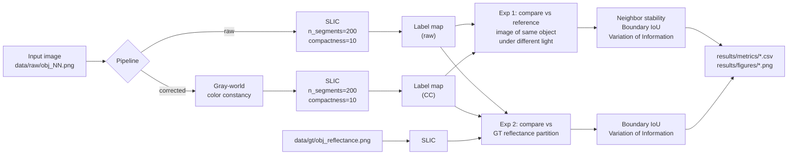

# Illumination-Invariant Superpixels

**Do superpixels stay put when the lighting changes — and does color constancy help?**

SLIC and friends group pixels by color similarity, which sounds reasonable until you
move the light. Then the segmentation quietly redraws itself, even though nothing
about the actual scene has changed. That's a problem if you're using superpixels as
a preprocessing step and expecting them to be stable.

So we measured it. We took four objects photographed under ten controlled lighting
conditions each, segmented everything, and asked how much the segmentation drifts.
Then we added a gray-world color constancy step in front of SLIC to see whether
normalizing the illuminant first makes things more repeatable.

Short version: **it does.** Across all 4 objects and 11 illumination conditions,
color constancy improved every stability metric on every object.

**What this is:** an experimental study rather than a library or a deployed tool. The
deliverable is the measured comparison and the figures behind it, produced by a CLI
that regenerates everything from the dataset. It's aimed at someone deciding whether
to put an illuminant-normalisation step in front of a superpixel stage — the results
say what that buys on controlled captures, on which metric, and where the effect
stops being clear-cut.

<p align="center">
  <br>
  <em>The same apple under three lighting conditions. Left: the input.
  Middle: SLIC on raw RGB. Right: SLIC after gray-world correction.</em>
</p>

---

## The headline result

Here's the setup: we segment each image, then compare it against the segmentation
of a reference image of the *same object* under *different* lighting. If a method is
stable, those two segmentations should look alike. If it isn't, they won't.

| Metric | Raw RGB | + Gray-World CC | Change |
|---|---|---|---|
| Neighbor stability ↑ | 0.9711 | **0.9729** | +0.19% |
| Boundary IoU ↑ | 0.3331 | **0.3493** | **+4.84%** |
| Variation of Information ↓ | 1.2604 | **1.1747** | **−6.80%** |

Averaged across all four objects. ↑ means higher is better, ↓ means lower is better.
Worth stressing: **color constancy won on 4/4 objects for all 3 metrics.** The
direction is consistent everywhere, so this isn't an artifact of averaging a couple
of big wins against some losses.

Both conditions run the same SLIC implementation at the same settings, over the same
images, against the same reference protocol. The only thing that differs is whether
the gray-world step executes. So the gap between those two columns is attributable to
the correction itself, and not to segmentation settings, image selection, or the
choice of reference.

Here's what that looks like on a single image — same photo, same SLIC settings, the
only difference being whether we normalize the illuminant first:

<p align="center">
  <br>
  <em>Notice the corrected version pulls the warm cast out of the apple, so SLIC
  splits it on reflectance changes rather than on the lighting gradient.</em>
</p>

The gains also land where you'd hope. Boundary IoU and VI are the two metrics that
actually care whether *the same boundaries* get drawn, and both move meaningfully.
Neighbor stability barely budges — but that's expected, since it's dominated by the
large uniform background regions that stay grouped together no matter what you do
to the color.

---

## How it works



### Why gray-world

Gray-world rests on a simple assumption: average out a whole scene and you should get
something roughly gray. So we take the per-channel mean and rescale each channel until
all three means agree. In practice that cancels a global color cast from the
illuminant, and SLIC never sees the original tint at all.

It's also the reference method for color constancy (Buchsbaum, 1980), and — more
importantly for this experiment — it is **parameter-free**. The correction is
determined entirely by the image's own channel means, with nothing fitted and nothing
to tune. That property is why it's the right choice here. A tunable or learned
estimator would introduce a confound: any improvement could then be attributed to
fitting the correction to this particular dataset rather than to illuminant
normalisation as such. Keeping the correction parameter-free means the comparison
varies exactly one uncontrolled thing. Whether the effect holds for tunable estimators
is a separate question this design doesn't address.

### Two protocols, two questions

**We run two comparisons, and they're asking different things.** This matters more
than it might look:

1. **Self-consistency** (`--stability`) takes the first image of each object as the
   reference, segments all 11 illumination variants, and scores each variant against
   that reference — raw against the raw reference, CC against the CC reference. Each
   pipeline gets judged against itself. *Does it agree with itself when the light
   moves?*

2. **Reflectance baseline** (`--reflectance`) instead segments the ground-truth
   reflectance image — the illumination-free version of the scene that ships with MIT
   Intrinsic Images — and scores both pipelines against that fixed, external
   partition. *Does the pipeline actually recover the true illumination-invariant
   boundaries?*

Those two can disagree, and on this dataset they do. More on that below.

### The comparison is paired

Every comparison is within-object: a variant is only ever scored against a reference
image of the same object. Object identity, geometry, viewpoint, material and camera
position are all constant inside a comparison, and illumination is the only factor
that moves. The set is 4 objects × 11 conditions = 44 images, and the paired structure
is what makes that workable — each object acts as its own control rather than being
pooled with the others.

---

## The metrics

| Metric | What it measures | Range | Better |
|---|---|---|---|
| **Neighbor stability** | Of the adjacent pixel pairs grouped together in the reference, how many stay grouped in the variant | 0–1 | ↑ |
| **Boundary IoU** | Intersection-over-union of the two superpixel boundary maps | 0–1 | ↑ |
| **Variation of Information** | Information-theoretic distance between two partitions, `H(X) + H(Y) − 2·I(X;Y)` | 0–∞ bits | ↓ |
| **Boundary Recall** | How many ground-truth edges the superpixel boundaries recover | 0–1 | ↑ |
| **ASA** | Achievable Segmentation Accuracy — the accuracy ceiling this partition allows | 0–1 | ↑ |

All five live in `src/metrics.py`. The experiments here report the first three;
Boundary Recall and ASA are implemented and ready if you want to evaluate against
the ground-truth masks in `data/gt/`.

One note on reading the numbers: boundary IoU asks for near-exact pixel coincidence
between two independently computed segmentations, so absolute values sit well below 1
even for visually similar results — the interpretable quantity here is the change
between conditions, measured under identical settings.

---

## Getting started

```bash
git clone https://github.com/Salman-Awaise/illumination-invariant-superpixels.git
cd illumination-invariant-superpixels
pip install -r requirements.txt
```

You'll want Python 3.9 or newer. Dependencies are NumPy, OpenCV, scikit-image,
Matplotlib and pandas — nothing exotic.

### Running it

To run everything, metrics and figures both:

```bash
python main.py
```

Or pick a single stage if you only need one:

```bash
python main.py --stability     # stability metrics      -> results/metrics/
python main.py --reflectance   # reflectance baseline   -> results/metrics/ + figures/
python main.py --figures       # illumination grids     -> results/figures/
python main.py --examples      # before/after examples  -> results/figures/
```

You can also just import the pieces and use them directly:

```python
from src.preprocessing import load_image
from src.pipelines import run_raw_pipeline, run_cc_pipeline
from src.metrics import boundary_iou

img = load_image("apple_01.png")

labels_raw = run_raw_pipeline(img, n_segments=200, compactness=10.0)
img_cc, labels_cc = run_cc_pipeline(img, cc_method="gray_world")

print(boundary_iou(labels_raw, labels_cc))
```

### Knobs worth turning

The defaults live in `src/config.py`:

| Setting | Default | What it does |
|---|---|---|
| `DEFAULT_N_SEGMENTS` | `200` | Roughly how many superpixels you get |
| `DEFAULT_COMPACTNESS` | `10.0` | Turn it up for squarer superpixels, down to hug color edges more tightly |

Both are held fixed across every condition in the reported experiments, so the
comparison isn't sensitive to how they were picked.

---

## What's where, and who wrote it

| Module | Responsibility | Implementation |
|---|---|---|
| `preprocessing.py` | image loading, gray-world color constancy | Sameer Syed |
| `superpixels.py` | SLIC segmentation, boundary overlays | Sameer Syed |
| `utils.py` | image and label-map I/O | Sameer Syed |
| `pipelines.py` | raw pipeline and color-constancy pipeline | Salman Awaise |
| `metrics.py` | stability, boundary IoU, VI, boundary recall, ASA | Salman Awaise |
| `stability_analysis.py` | experiment 1: self-consistency across lighting | Salman Awaise |
| `reflectance_baseline.py` | experiment 2: agreement with GT reflectance | Salman Awaise |
| `visualization.py` | illumination grid figures | Salman Awaise |

Salman Awaise built the superpixel pipelines, the evaluation metrics, and both
experimental protocols, including the stability, boundary IoU and VI analysis.
Sameer Syed built the data loading and color constancy, the SLIC segmentation and
visualization layer, and the I/O utilities.

`config.py`, `main.py` and `example_figures.py` were added later, when the project
moved from a single notebook to the module layout above, and sit outside that split.

```
.
├── main.py                     CLI entry point
├── requirements.txt
├── data/
│   ├── raw/                    44 images: 4 objects × (10 illuminations + original)
│   └── gt/                     reflectance, shading and mask ground truth
├── src/                        the modules in the table above
├── tests/                      property and integration tests
└── results/
    ├── figures/                illumination grids and comparison plots
    └── metrics/                CSV summaries
```

## The data

Four objects — `apple`, `cup1`, `deer` and `frog1` — each shot under 10 controlled
illumination conditions plus an original, somewhere in the range of 334×334 to
400×334 pixels. The images, and the `reflectance` / `shading` / `mask` ground truth,
come from the **MIT Intrinsic Images** dataset (Grosse et al., ICCV 2009), which
carries its own licensing terms; the subset here is redistributed for reproducibility
of these experiments.

The ground truth matters for experiment 2 specifically: because the dataset ships a
reflectance image per object, there is an externally-defined illumination-free target
to compare against, rather than only the pipelines' own outputs.

## Results in full

### Experiment 1 — self-consistency across lighting

Per-object numbers, straight out of `results/metrics/stability_summary_all_metrics.csv`:

| Object | Stability raw | Stability CC | bIoU raw | bIoU CC | VI raw | VI CC |
|---|---|---|---|---|---|---|
| apple | 0.9724 | 0.9758 | 0.3604 | **0.3978** | 1.1570 | **0.9947** |
| deer  | 0.9686 | 0.9702 | 0.3060 | **0.3137** | 1.3625 | **1.2849** |
| cup1  | 0.9752 | 0.9755 | 0.3460 | **0.3496** | 1.1591 | **1.1467** |
| frog1 | 0.9683 | 0.9703 | 0.3202 | **0.3360** | 1.3630 | **1.2722** |

Color constancy takes every column on every object. Clean sweep.

To make that concrete, here's the boundary IoU column rendered as a picture. We
overlay the segmentation of `apple_01` on the segmentation of `apple_08` — the same
apple under different light — and color-code where the two agree:

<p align="center">
  <br>
  <em>White is where both segmentations drew the same boundary; red and blue are
  where only one of them did. The background grid agrees either way — the
  disagreement is concentrated on the object, which is exactly where the lighting
  changed.</em>
</p>

We picked `apple_08` deliberately rather than for effect: of the ten variants, its
improvement is the closest to the average, so it's a representative case rather than
the most flattering one.

### Experiment 2 — reflectance baseline

Now the same two pipelines, but scored against the segmentation of the ground-truth
reflectance image rather than against themselves
(`results/metrics/reflectance_baseline_summary.csv`):

| Object | IoU raw | IoU cc | VI raw | VI cc |
|---|---|---|---|---|
| apple | **0.3092** | 0.2903 | **1.2292** | 1.2605 |
| deer  | 0.2342 | **0.2370** | 1.5217 | **1.4663** |
| cup1  | 0.3010 | **0.3036** | 1.1840 | **1.1813** |
| frog1 | **0.2327** | 0.2246 | 1.5873 | **1.5775** |

Color constancy takes 2/4 on boundary IoU and 3/4 on VI here.

<p align="center">
  <br>
  <em>The left panel is the target: SLIC run on the illumination-free reflectance
  image. On this particular image raw RGB scores slightly higher than the corrected
  version — the mixed result in the table above, made visible.</em>
</p>

### What the divergence tells us

The two protocols disagree, and the disagreement is itself a result.

Self-consistency asks whether a pipeline reproduces its own output. The reflectance
comparison asks whether it recovers the correct partition. Gray-world necessarily
moves every variant of a scene toward a common channel-mean, which mechanically
increases how much the variants resemble one another — and self-consistency will
register that as improvement whether or not the shared boundaries are the right ones.
A fixed external reference can't be inflated the same way.

The evidence here is consistent with that account rather than establishing it. What
it does establish is that the two protocols are not interchangeable, and that
reporting the self-consistency number alone would overstate what the correction
achieves. If you take one thing from this project, take that: the obvious way to
measure superpixel stability rewards a preprocessing step for making its own inputs
more similar, which is not the same as making them more correct.

## What the results cover

The measured effect is specific, and worth stating precisely:

- **Controlled captures.** Single-illuminant photographs of isolated objects against
  a dark background. Natural scenes, cast shadows and multi-illuminant conditions are
  outside what these images test.
- **One correction, by design.** Gray-world, chosen parameter-free for the reasons
  above. The result speaks to illuminant normalisation of that kind.
- **One operating point.** SLIC at 200 segments and compactness 10, held fixed across
  every condition so the comparison stays controlled. How the effect scales with
  superpixel count would need a sweep across operating points.
- **Two protocols, two answers.** Self-consistency improves unanimously; agreement
  with the reflectance target is mixed. Both are reported above, and any claim drawn
  from this project should say which one it rests on.

## Verification

The metrics and pipelines are covered by 36 tests in `tests/`, runnable with `pytest`:

```bash
pip install pytest
python -m pytest tests/ -q
```

They check the things the reported numbers depend on:

- **Identity cases.** A segmentation compared against itself must score a perfect
  boundary IoU and stability, and 0.0 on VI. A sign or indexing error breaks these
  immediately. The tests also pin two edge behaviours so they stay visible: every
  ratio metric carries a `+1e-6` guard that leaves a perfect match a hair under 1.0,
  and `compute_stability` returns 0.0 rather than 1.0 when the reference groups no
  adjacent pixels at all, since it normalises by exactly those pairs.
- **Bounds and symmetry.** IoU, stability and ASA stay within [0,1], VI stays
  non-negative, and the pairwise metrics give the same answer in either argument
  order.
- **Known answers.** `labels_to_boundaries` is checked against a boundary map worked
  out by hand, and ASA against a case where superpixels nest inside ground-truth
  regions and the score must be exactly 1.
- **Error paths.** The shape guards in the three pairwise metrics are exercised
  rather than assumed.
- **Correction behaviour.** Gray-world leaves an already-neutral image alone, reduces
  the spread of channel means on a cast image, preserves flat regions, doesn't mutate
  its input, and rejects unimplemented methods.
- **Determinism.** SLIC returns identical labels across repeated runs, and the two
  pipelines provably differ on a lit image. The first is what every reproducibility
  claim below rests on; the second guards against the correction silently becoming a
  no-op.

The suite was checked by mutation: breaking the boundary-map axis and stubbing out
the correction step both produce failures, so the tests are known to discriminate
rather than merely pass.

## Reproducing this

`python main.py` regenerates every CSV and figure under `results/`. SLIC is
deterministic here, so you should get exact matches rather than approximate ones —
`stability_summary_all_metrics.csv` reproduces to full float64 precision on
Python 3.12 with scikit-image 0.26, and `reflectance_baseline_summary.csv` matches on
11 of its 16 values bit-exactly, with the other 5 off only in the last unit or two
in the last place from floating-point summation order.

Worth knowing if your numbers differ slightly: that last kind of gap is a library and
platform artifact rather than a change in the method, and the way to tell them apart
is to check whether the difference survives a change of environment.

## References

- Achanta et al. *SLIC Superpixels Compared to State-of-the-Art Superpixel Methods.* TPAMI 2012.
- Buchsbaum. *A spatial processor model for object colour perception.* Journal of the Franklin Institute, 1980. (gray-world)
- Grosse et al. *Ground truth dataset and baseline evaluations for intrinsic image algorithms.* ICCV 2009.
- Meilă. *Comparing clusterings — an information based distance.* Journal of Multivariate Analysis, 2007. (VI)
