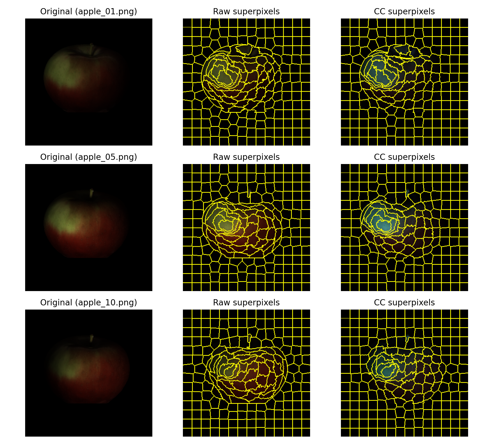
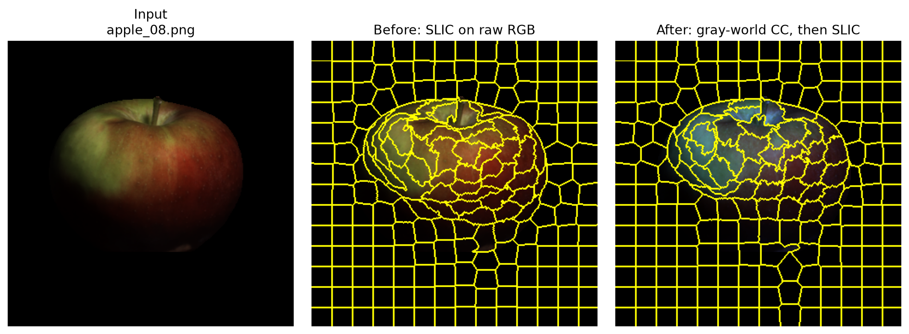
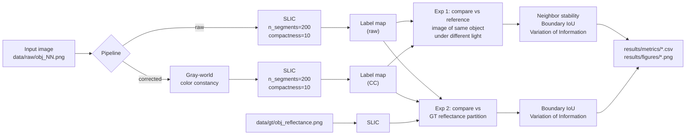
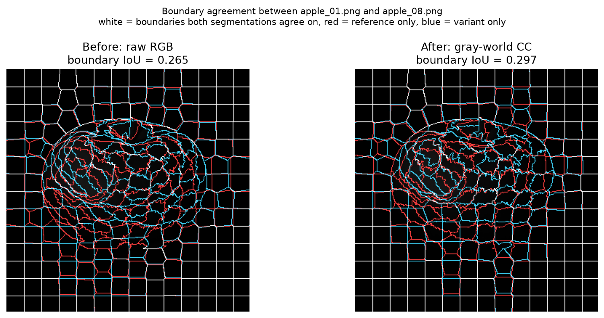
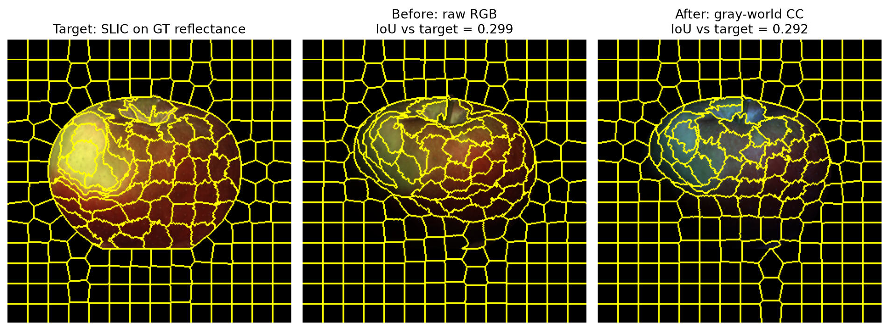

# Illumination-Invariant Superpixels

**Do superpixels stay put when the lighting changes — and does color constancy help?**

SLIC and friends group pixels by color similarity, which sounds reasonable until you
move the light. Then the segmentation quietly redraws itself, even though nothing
about the actual scene has changed. That's a problem if you're using superpixels as
a preprocessing step and expecting them to be stable.

So we measured it. We took four objects photographed under ten controlled lighting
conditions each, segmented everything, and asked how much the segmentation drifts.
Then we added a gray-world color constancy step in front of SLIC to see whether
normalizing the illuminant first makes things more repeatable.

Short version: **it does.** Across all 4 objects and 11 illumination conditions,
color constancy improved every stability metric on every object.

<p align="center">
  <br>
  <em>The same apple under three lighting conditions. Left: the input.
  Middle: SLIC on raw RGB. Right: SLIC after gray-world correction.</em>
</p>

---

## The headline result

Here's the setup: we segment each image, then compare it against the segmentation
of a reference image of the *same object* under *different* lighting. If a method is
stable, those two segmentations should look alike. If it isn't, they won't.

| Metric | Raw RGB | + Gray-World CC | Change |
|---|---|---|---|
| Neighbor stability ↑ | 0.9711 | **0.9729** | +0.19% |
| Boundary IoU ↑ | 0.3331 | **0.3493** | **+4.84%** |
| Variation of Information ↓ | 1.2604 | **1.1747** | **−6.80%** |

Averaged across all four objects. ↑ means higher is better, ↓ means lower is better.
Worth stressing: **color constancy won on 4/4 objects for all 3 metrics.** The
direction is consistent everywhere, so this isn't an artifact of averaging a couple
of big wins against some losses.

Here's what that actually looks like on a single image — same photo, same SLIC
settings, the only difference being whether we normalize the illuminant first:

<p align="center">
  <br>
  <em>Notice the corrected version pulls the warm cast out of the apple, so SLIC
  splits it on reflectance changes rather than on the lighting gradient.</em>
</p>

The gains also land where you'd hope. Boundary IoU and VI are the two metrics that
actually care whether *the same boundaries* get drawn, and both move meaningfully.
Neighbor stability barely budges — but that's expected, since it's dominated by the
large uniform background regions that stay grouped together no matter what you do
to the color.

---

## How it works



**Gray-world color constancy** rests on a simple assumption: average out a whole
scene and you should get something roughly gray. So we take the per-channel mean and
rescale each channel until all three means agree. In practice that cancels a global
color cast from the illuminant, and SLIC never sees the original tint at all.

**We run two comparisons, and they're asking different questions.** This matters more
than it might look:

1. **Self-consistency** (`--stability`) takes the first image of each object as the
   reference, segments all 11 illumination variants, and scores each variant against
   that reference — raw against the raw reference, CC against the CC reference. Each
   pipeline gets judged against itself. *Does it agree with itself when the light
   moves?*

2. **Reflectance baseline** (`--reflectance`) instead segments the ground-truth
   reflectance image — the illumination-free version of the scene that ships with MIT
   Intrinsic Images — and scores both pipelines against that fixed, external
   partition. *Does the pipeline actually recover the true illumination-invariant
   boundaries?*

Those two can disagree, and on this dataset they do. More on that below.

---

## The metrics

| Metric | What it measures | Range | Better |
|---|---|---|---|
| **Neighbor stability** | Of the adjacent pixel pairs grouped together in the reference, how many stay grouped in the variant | 0–1 | ↑ |
| **Boundary IoU** | Intersection-over-union of the two superpixel boundary maps | 0–1 | ↑ |
| **Variation of Information** | Information-theoretic distance between two partitions, `H(X) + H(Y) − 2·I(X;Y)` | 0–∞ bits | ↓ |
| **Boundary Recall** | How many ground-truth edges the superpixel boundaries recover | 0–1 | ↑ |
| **ASA** | Achievable Segmentation Accuracy — the accuracy ceiling this partition allows | 0–1 | ↑ |

All five live in `src/metrics.py`. The experiments here report the first three;
Boundary Recall and ASA are implemented and ready if you want to evaluate against
the ground-truth masks in `data/gt/`.

---

## Getting started

```bash
git clone https://github.com/Salman-Awaise/illumination-invariant-superpixels.git
cd illumination-invariant-superpixels
pip install -r requirements.txt
```

You'll want Python 3.9 or newer. Dependencies are NumPy, OpenCV, scikit-image,
Matplotlib and pandas — nothing exotic.

### Running it

To run everything, metrics and figures both:

```bash
python main.py
```

Or pick a single stage if you only need one:

```bash
python main.py --stability     # stability metrics      -> results/metrics/
python main.py --reflectance   # reflectance baseline   -> results/metrics/ + figures/
python main.py --figures       # illumination grids     -> results/figures/
python main.py --examples      # before/after examples  -> results/figures/
```

You can also just import the pieces and use them directly:

```python
from src.preprocessing import load_image
from src.pipelines import run_raw_pipeline, run_cc_pipeline
from src.metrics import boundary_iou

img = load_image("apple_01.png")

labels_raw = run_raw_pipeline(img, n_segments=200, compactness=10.0)
img_cc, labels_cc = run_cc_pipeline(img, cc_method="gray_world")

print(boundary_iou(labels_raw, labels_cc))
```

### Knobs worth turning

The defaults live in `src/config.py`:

| Setting | Default | What it does |
|---|---|---|
| `DEFAULT_N_SEGMENTS` | `200` | Roughly how many superpixels you get |
| `DEFAULT_COMPACTNESS` | `10.0` | Turn it up for squarer superpixels, down to hug color edges more tightly |

---

## What's where

```
.
├── main.py                     CLI entry point
├── requirements.txt
├── data/
│   ├── raw/                    44 images: 4 objects × (10 illuminations + original)
│   └── gt/                     reflectance, shading and mask ground truth
├── src/
│   ├── config.py               paths and default SLIC parameters
│   ├── preprocessing.py        image loading, gray-world color constancy
│   ├── superpixels.py          SLIC segmentation, boundary overlays
│   ├── pipelines.py            raw pipeline and color-constancy pipeline
│   ├── metrics.py              stability, boundary IoU, VI, boundary recall, ASA
│   ├── stability_analysis.py   experiment 1: self-consistency across lighting
│   ├── reflectance_baseline.py experiment 2: agreement with GT reflectance
│   ├── visualization.py        illumination grid figures
│   ├── example_figures.py      the before/after figures used in this README
│   └── utils.py                image and label-map I/O
└── results/
    ├── figures/                illumination grids and comparison plots
    └── metrics/                CSV summaries
```

## The data

Four objects — `apple`, `cup1`, `deer` and `frog1` — each shot under 10 controlled
illumination conditions plus an original, somewhere in the range of 334×334 to
400×334 pixels. The object set and the `reflectance` / `shading` / `mask` ground-truth
layout come from the **MIT Intrinsic Images** dataset (Grosse et al., ICCV 2009).

## Results in full

### Experiment 1 — self-consistency across lighting

Per-object numbers, straight out of `results/metrics/stability_summary_all_metrics.csv`:

| Object | Stability raw | Stability CC | bIoU raw | bIoU CC | VI raw | VI CC |
|---|---|---|---|---|---|---|
| apple | 0.9724 | 0.9758 | 0.3604 | **0.3978** | 1.1570 | **0.9947** |
| deer  | 0.9686 | 0.9702 | 0.3060 | **0.3137** | 1.3625 | **1.2849** |
| cup1  | 0.9752 | 0.9755 | 0.3460 | **0.3496** | 1.1591 | **1.1467** |
| frog1 | 0.9683 | 0.9703 | 0.3202 | **0.3360** | 1.3630 | **1.2722** |

Color constancy takes every column on every object. Clean sweep.

To make that concrete, here's the boundary IoU column rendered as a picture. We
overlay the segmentation of `apple_01` on the segmentation of `apple_08` — the same
apple under different light — and color-code where the two agree:

<p align="center">
  <br>
  <em>White is where both segmentations drew the same boundary; red and blue are
  where only one of them did. The background grid agrees either way — the
  disagreement is concentrated on the object, which is exactly where the lighting
  changed.</em>
</p>

We picked `apple_08` deliberately rather than for effect: of the ten variants, its
improvement is the closest to the average, so it's a representative case rather than
the most flattering one.

### Experiment 2 — reflectance baseline

Now the same two pipelines, but scored against the segmentation of the ground-truth
reflectance image rather than against themselves
(`results/metrics/reflectance_baseline_summary.csv`):

| Object | IoU raw | IoU cc | VI raw | VI cc |
|---|---|---|---|---|
| apple | **0.3092** | 0.2903 | **1.2292** | 1.2605 |
| deer  | 0.2342 | **0.2370** | 1.5217 | **1.4663** |
| cup1  | 0.3010 | **0.3036** | 1.1840 | **1.1813** |
| frog1 | **0.2327** | 0.2246 | 1.5873 | **1.5775** |

This one's messier. Color constancy takes 2/4 on boundary IoU and 3/4 on VI — a far
cry from the clean sweep above.

<p align="center">
  <br>
  <em>The left panel is the target: SLIC run on the illumination-free reflectance
  image. On this particular image raw RGB actually scores slightly higher than the
  corrected version — which is the mixed result in the table above, made visible.</em>
</p>

We think that gap is the interesting part, and there's a plausible mechanism behind
it. Gray-world pulls every image toward the same gray average, which nudges all 11
illumination variants toward a common appearance. That raises their agreement with
*each other* regardless of whether the boundaries they now share are the *right*
ones. The reflectance baseline doesn't have that loophole, because its reference is
external and fixed.

Put the two together and the honest reading is this: **color constancy makes SLIC
reliably more repeatable, but on this dataset it doesn't clearly move it closer to
true illumination invariance.** Both things are worth knowing.

## Where this falls short

- **Only one color constancy method.** Gray-world and nothing else — `apply_color_constancy`
  raises `NotImplementedError` for anything you throw at it. White-patch,
  Shades-of-Gray or a learned estimator would make for a much stronger comparison.
- **The dataset is small.** Four objects from a controlled lab setup. No natural
  scenes, no cast shadows, no multi-illuminant cases.
- **One algorithm, one operating point.** SLIC at 200 segments and compactness 10.
  We didn't sweep superpixel count, and the conclusions might not survive it.
- **The absolute numbers are modest.** Boundary IoU around 0.33–0.35 means only about
  a third of boundaries are shared with the reference. Color constancy helps, but
  illumination invariance is nowhere near solved here.
- **The two experiments disagree.** Self-consistency backs color constancy
  unanimously; the reflectance baseline doesn't. Any claim drawn from this should
  cite both rather than picking the flattering one.

## Reproducing this

`python main.py` regenerates every CSV and figure under `results/`. SLIC is
deterministic here, so you should get exact matches rather than approximate ones —
`stability_summary_all_metrics.csv` reproduces to full float64 precision on
Python 3.12 with scikit-image 0.26, and `reflectance_baseline_summary.csv` matches on
11 of its 16 values bit-exactly, with the other 5 off only in the last unit or two
in the last place from floating-point summation order.

## Who did what

**Salman Awaise** — superpixel pipelines, evaluation metrics, and the stability /
boundary IoU / VI experiments  
**Sameer Syed** — data loading and color constancy, SLIC segmentation and
visualization, I/O utilities

Built for **CS 7180: Advanced Perception** at Northeastern University.

## References

- Achanta et al. *SLIC Superpixels Compared to State-of-the-Art Superpixel Methods.* TPAMI 2012.
- Buchsbaum. *A spatial processor model for object colour perception.* Journal of the Franklin Institute, 1980. (gray-world)
- Grosse et al. *Ground truth dataset and baseline evaluations for intrinsic image algorithms.* ICCV 2009.
- Meilă. *Comparing clusterings — an information based distance.* Journal of Multivariate Analysis, 2007. (VI)
